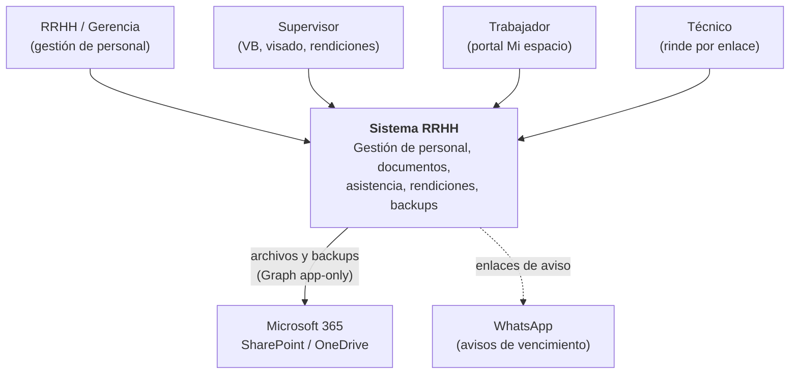
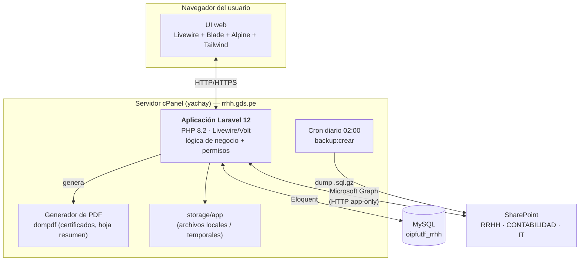

# Referencia — Arquitectura (modelo C4)

> **Tipo:** Referencia / Explicación · **Audiencia:** Técnica · **Actualizado:** 2026-07-23
>
> Vista de arquitectura en dos niveles del modelo [C4](https://c4model.com):
> **Contexto** (con qué se relaciona el sistema) y **Contenedores** (de qué piezas
> se compone). Diagramas en Mermaid (se renderizan en GitHub).

## Nivel 1 — Contexto

Quién usa el sistema y con qué servicios externos habla.

## Nivel 2 — Contenedores

Las piezas técnicas que forman el sistema.

## Notas técnicas

- **Framework:** Laravel 12 (PHP 8.2), Livewire 3 + Volt (componentes single-file),
  Blade, Alpine.js, Tailwind v3.
- **Permisos:** `spatie/laravel-permission` (roles + permisos `modulo.accion`);
  `Gate::before` deja pasar a SuperAdmin. Ver [roles-y-permisos.md](roles-y-permisos.md).
- **Almacenamiento de archivos:** Microsoft Graph **app-only** (client credentials),
  HTTP puro (sin SDK). Multi-destino: documentos→RRHH, rendiciones→CONTABILIDAD,
  backups→IT. Patrón "guardar-local-y-reintentar" si Graph falla. Ver
  [docs/15](../15-integracion-sharepoint-graph.md).
- **PDF:** `barryvdh/laravel-dompdf`.
- **Backups:** dumper PHP puro (sin `mysqldump`) → `.sql.gz` → SharePoint IT, diario.
  Ver [docs/19](../19-backups-automaticos-plan.md).
- **Cifrado en reposo:** cuenta/CCI/sueldo cifrados con el `APP_KEY` (cast `encrypted`).
- **Sin colas ni Redis:** sesión/caché en archivo, `QUEUE_CONNECTION=sync`
  (para que `/_setup` funcione sin tablas).
- **Despliegue:** cPanel sin SSH, re-clonado + `/_setup/{token}`. Ver
  [docs/09](../09-deploy-cpanel.md) y [docs/20](../20-redeploy-2026-07-21.md).

## Decisiones de arquitectura (dónde están)

Los "por qué" de cada decisión importante viven en los docs de planificación:
[02](../02-arquitectura.md) (base), [15](../15-integracion-sharepoint-graph.md) (SharePoint),
[16](../16-rendiciones-plan.md) (rendiciones), [19](../19-backups-automaticos-plan.md) (backups).
