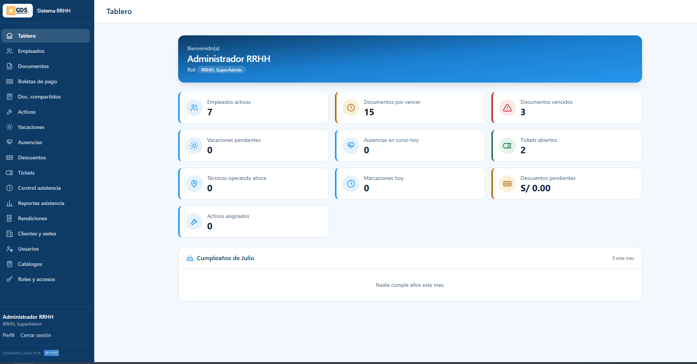
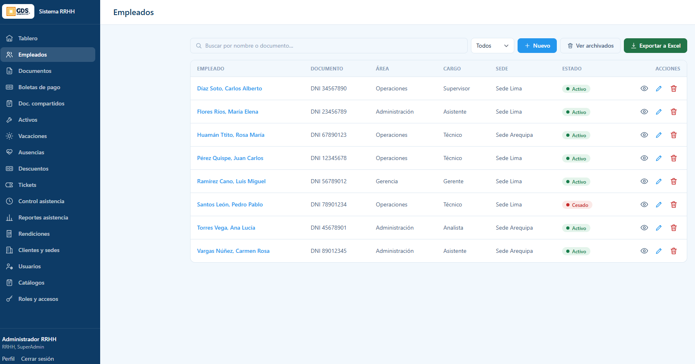
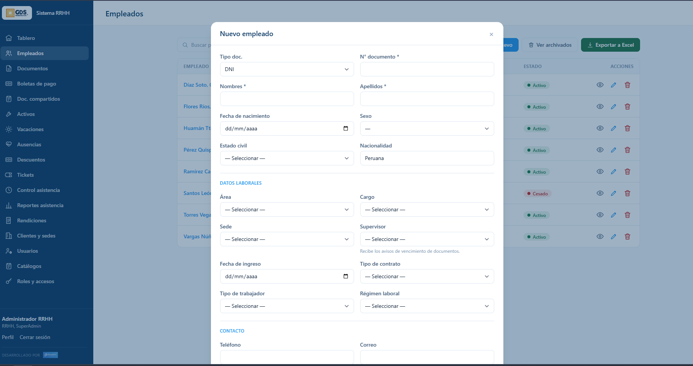
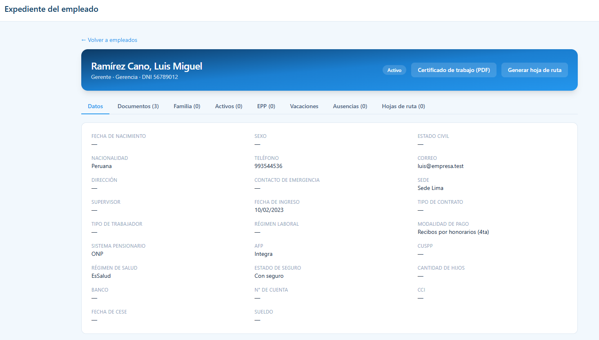
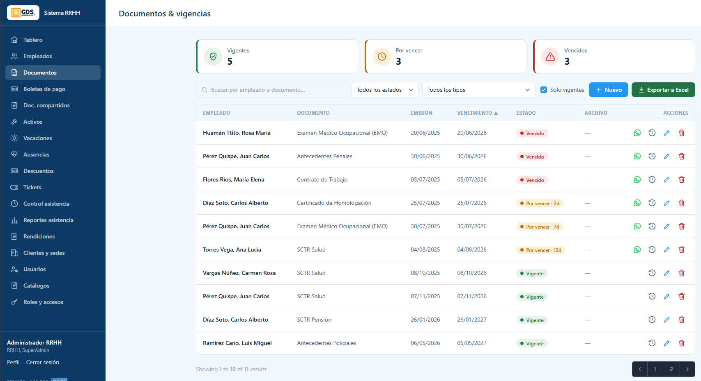
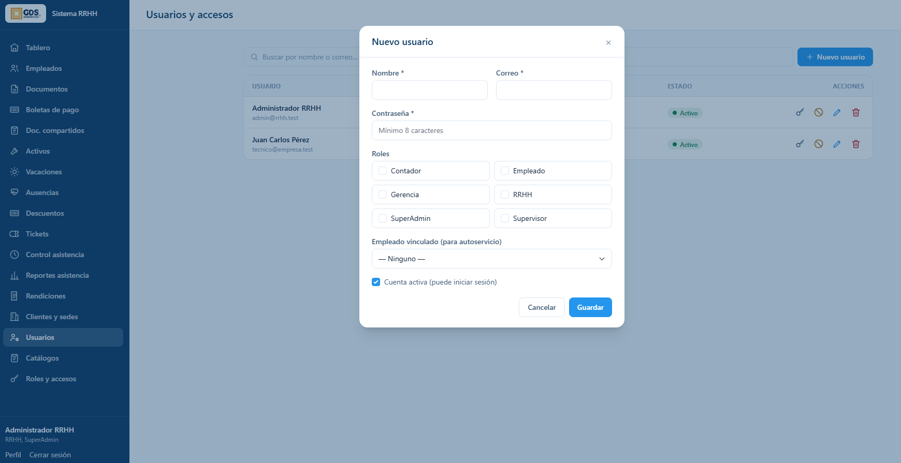
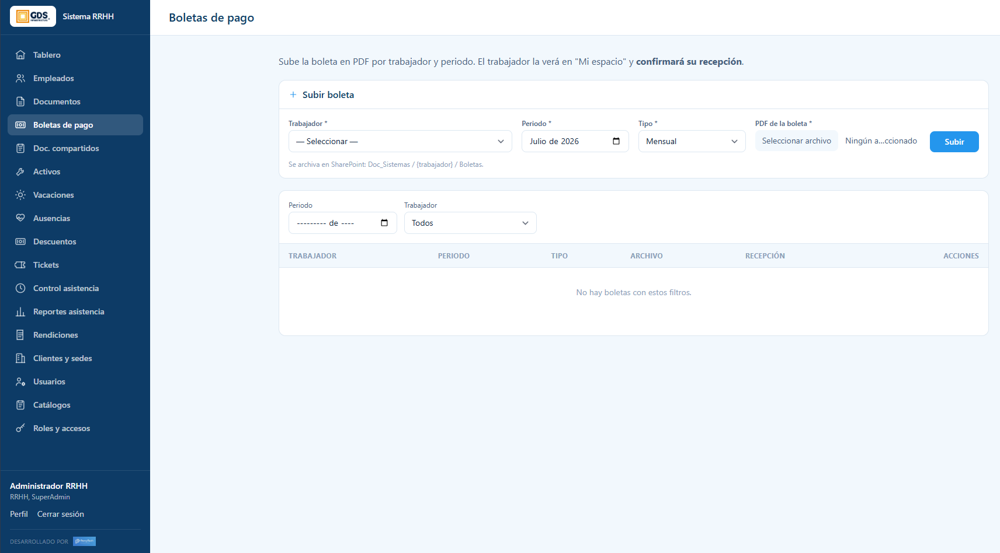
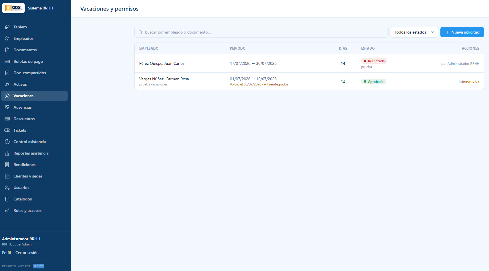
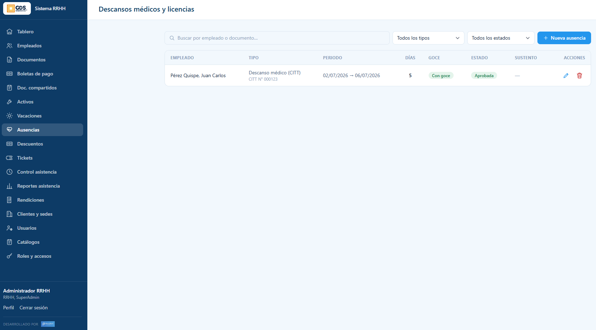
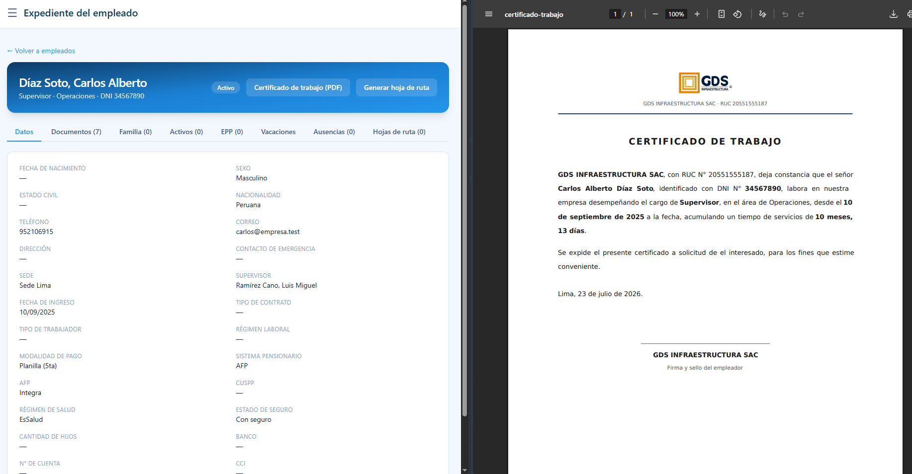

# Guía de RRHH

> **Tipo:** Guía de usuario (how-to) · **Audiencia:** Recursos Humanos · **Actualizado:** 2026-07-23
>
> Cómo gestionar el personal en el Sistema RRHH: registrar empleados, controlar
> documentos y vencimientos, crear accesos, publicar boletas, y aprobar vacaciones
> y licencias.

## Índice
1. [Ingreso y Tablero](#1-ingreso-y-tablero)
2. [Empleados](#2-empleados)
3. [Expediente del empleado](#3-expediente-del-empleado)
4. [Documentos y vigencias](#4-documentos-y-vigencias)
5. [Usuarios y accesos](#5-usuarios-y-accesos)
6. [Boletas de pago](#6-boletas-de-pago)
7. [Vacaciones](#7-vacaciones)
8. [Ausencias y licencias](#8-ausencias-y-licencias)
9. [Certificado de trabajo](#9-certificado-de-trabajo)

---

## 1. Ingreso y Tablero

Ingresa a **https://rrhh.gds.pe** con tu correo y contraseña. Al entrar, verás el
**Tablero**.

- El **menú lateral izquierdo** te lleva a cada módulo (Empleados, Documentos,
  Boletas, Vacaciones, Ausencias, etc.).
- Las **tarjetas (KPIs)** resumen el estado del sistema: empleados activos,
  **documentos por vencer** y **vencidos**, vacaciones pendientes, tickets
  abiertos, entre otros. **Haz clic en una tarjeta** para ir directo a ese módulo
  ya filtrado (ej. clic en "Documentos por vencer" abre la lista de esos documentos).
- El panel **Cumpleaños del mes** lista al personal que cumple años, para tenerlo a la vista.

> Nota: si tu usuario también es SuperAdmin, verás en el menú opciones adicionales
> (Catálogos, Roles y accesos) que son exclusivas de administración del sistema.

---

## 2. Empleados

El módulo **Empleados** es el centro de la gestión de personal.

Desde aquí puedes:
- **Buscar** por nombre o documento y **filtrar** por estado.
- **Exportar a Excel** toda la lista.
- **Ver archivados** (empleados dados de baja).
- En cada fila, las acciones: **ver el expediente** (ojo), **editar** (lápiz) y
  **archivar/eliminar** (papelera). El **estado** muestra *Activo* o *Cesado*.

### Registrar un empleado nuevo

Pulsa **"+ Nuevo"** y completa el formulario:

El formulario está organizado en secciones:
- **Identificación:** tipo y N° de documento (obligatorios), nombres, apellidos,
  fecha de nacimiento, **sexo**, estado civil, nacionalidad.
- **Datos laborales:** área, cargo, sede, **supervisor** (quien *recibe los avisos
  de vencimiento de documentos*), fecha de ingreso, tipo de contrato, tipo de
  trabajador y régimen laboral.
- **Contacto:** teléfono, correo, dirección, contacto de emergencia.
- Más abajo: datos de planilla (sistema pensionario, régimen de salud, banco y
  cuenta) y la opción de adjuntar **DNI** y **CV** desde el inicio.

Los campos con **\*** son obligatorios. Al guardar, el empleado aparece en la lista.

> **Recomendación:** registra al **supervisor** del trabajador. Así, cuando un
> documento esté por vencer, el aviso llega a la persona correcta.

---

## 3. Expediente del empleado

Desde la lista, pulsa el **ojo** de un empleado para abrir su **expediente**.

En la cabecera ves su **nombre, cargo, área y documento**, su **estado**, y dos
acciones: **Certificado de trabajo (PDF)** y **Generar hoja de ruta**.

Las **pestañas** organizan toda su información:

| Pestaña | Contiene |
|---|---|
| **Datos** | Ficha completa (personal, laboral, planilla). |
| **Documentos** | Sus documentos con vencimientos; permite subir nuevos. |
| **Familia** | Derechohabientes (cónyuge, hijos). |
| **Activos** | Equipos/herramientas asignados. |
| **EPP** | Equipos de protección entregados. |
| **Vacaciones** | Su saldo y solicitudes. |
| **Ausencias** | Sus licencias y descansos médicos. |
| **Hojas de ruta** | Documentos de ruta generados. |

El número entre paréntesis indica cuántos elementos hay en cada pestaña.

---

## 4. Documentos y vigencias

El módulo **Documentos** controla los documentos del personal y **avisa antes de
que venzan** (SCTR, EMO, contratos, antecedentes, etc.).

- Las tarjetas de arriba resumen: **Vigentes**, **Por vencer** y **Vencidos**.
- Puedes **buscar**, filtrar por **estado** o **tipo**, y marcar **"Solo vigentes"**.
- **Exportar a Excel** el listado.
- Cada fila muestra **emisión**, **vencimiento** y **estado**:
  - **Vigente** — al día.
  - **Por vencer · Xd** — le quedan X días.
  - **Vencido** — ya caducó.
- En **Acciones** puedes: **avisar por WhatsApp** (ícono verde), ver el **historial**,
  **editar** y **eliminar**.

### Subir un documento

Pulsa **"+ Nuevo"**, elige el **empleado** y el **tipo de documento**, ingresa las
fechas de **emisión** y **vencimiento** (según el tipo, pueden dejarse en blanco si
el documento no vence) y adjunta el archivo (PDF o imagen). Se guarda en SharePoint
y el trabajador lo verá en su portal.

> El aviso de vencimiento se puede enviar por **WhatsApp** al supervisor con el
> ícono verde de cada fila.

---

## 5. Usuarios y accesos

Un empleado necesita un **usuario** para iniciar sesión y usar su portal
"Mi espacio". El módulo **Usuarios** los crea y los vincula a su ficha.

Pulsa **"+ Nuevo usuario"** y completa:
1. **Nombre** y **Correo** (con el que iniciará sesión).
2. **Contraseña** (mínimo 8 caracteres).
3. **Roles** — marca el o los roles (Empleado, Supervisor, RRHH, etc.).
4. **Empleado vinculado (para autoservicio)** — **muy importante:** selecciona la
   ficha del empleado. Así el usuario ve **su** "Mi espacio" (sus documentos,
   boletas, vacaciones, asistencia).
5. Deja marcada **"Cuenta activa"** para que pueda iniciar sesión.

En la lista, cada usuario tiene acciones para **restablecer contraseña**,
**desactivar**, **editar** y **eliminar**.

> **Regla clave:** para que un supervisor o alguien de RRHH tenga también su
> "Mi espacio" (porque igual es trabajador: cobra, marca asistencia), su usuario
> debe estar **vinculado a su ficha de empleado**.

---

## 6. Boletas de pago

El módulo **Boletas de pago** publica las boletas para que cada trabajador las vea
y **confirme su recepción**.

Para publicar una boleta:
1. En **"Subir boleta"**, elige el **Trabajador**, el **Periodo** (mes/año) y el
   **Tipo** (Mensual, gratificación, CTS, etc.).
2. Adjunta el **PDF de la boleta**.
3. Pulsa **"Subir"**.

El archivo se guarda en SharePoint (`Doc_Sistemas / {trabajador} / Boletas`) y el
trabajador la verá en su "Mi espacio", donde **confirma que la recibió**.

Abajo puedes **filtrar** las boletas publicadas por periodo y trabajador, y ver la
columna **Recepción** (si el trabajador ya la confirmó).

---

## 7. Vacaciones

El módulo **Vacaciones** gestiona las solicitudes y el saldo de días.

- Cada solicitud muestra **empleado**, **periodo**, **días** y **estado**.
- **Aprobar o rechazar:** usa las acciones de la fila. Cuando rechazas, queda el
  registro de quién lo hizo (ej. *por Administrador RRHH*).
- El sistema maneja el **saldo automáticamente** (2.5 días por mes prorrateados) y
  soporta el **retorno anticipado**: si el trabajador vuelve antes, los días no
  usados se **reintegran** al saldo (se ve como *"Volvió el … · +N reintegrados"*).

| Estado | Significa |
|---|---|
| **Pendiente** | Esperando tu aprobación. |
| **Aprobada** | Autorizada. |
| **Rechazada** | No autorizada. |

---

## 8. Ausencias y licencias

El módulo **Ausencias** registra descansos médicos (CITT), licencias y permisos, y
es donde RRHH da la **aprobación final** de las solicitudes del trabajador.

- Filtra por **tipo** y **estado**.
- Cada registro muestra **tipo** (ej. *Descanso médico (CITT) · CITT N° 000123*),
  **periodo**, **días**, si es **con goce** y su **estado**, además del **sustento** adjunto.
- **"+ Nueva ausencia"** permite registrar una directamente.

### Doble aprobación de licencias

Cuando un **trabajador solicita** una licencia desde su portal, el flujo es:

**Trabajador solicita → Supervisor visa → RRHH aprueba.**

RRHH da el **último paso**: revisa el sustento y **aprueba o rechaza**. Solo cuando
RRHH aprueba, la licencia queda oficialmente autorizada.

---

## 9. Certificado de trabajo

Desde el **expediente** de un empleado, pulsa **"Certificado de trabajo (PDF)"**
para generar el certificado automáticamente.

El PDF se arma solo con los datos del empleado: **logo de GDS**, nombre, documento,
**cargo, área**, fecha de ingreso y **tiempo de servicios** calculado. El texto se
**personaliza según el sexo** (el señor / la señora). Sirve tanto para trabajadores
**activos** como **cesados**.

**Flujo de uso:**
1. Genera el PDF e **imprímelo**.
2. Fírmalo y séllalo.
3. **Escanéalo y súbelo** al expediente como documento tipo *"Certificado de
   Trabajo"* (junto con la *Liquidación* y la *Carta de Renuncia* en un cese).

---

## ¿Dudas?

Para temas técnicos del sistema (accesos, errores, SharePoint), contacta al área de
**Sistemas / soporte**. Esta guía cubre las tareas más frecuentes de RRHH; los
demás módulos (Activos, Descuentos, Tickets, Asistencia, Rendiciones, Clientes)
siguen la misma lógica de lista + acciones.
