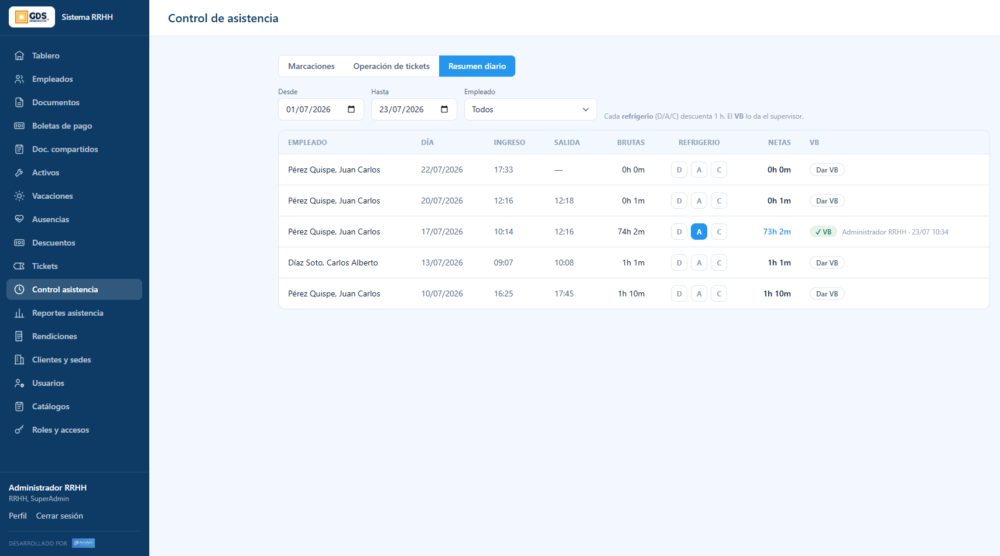
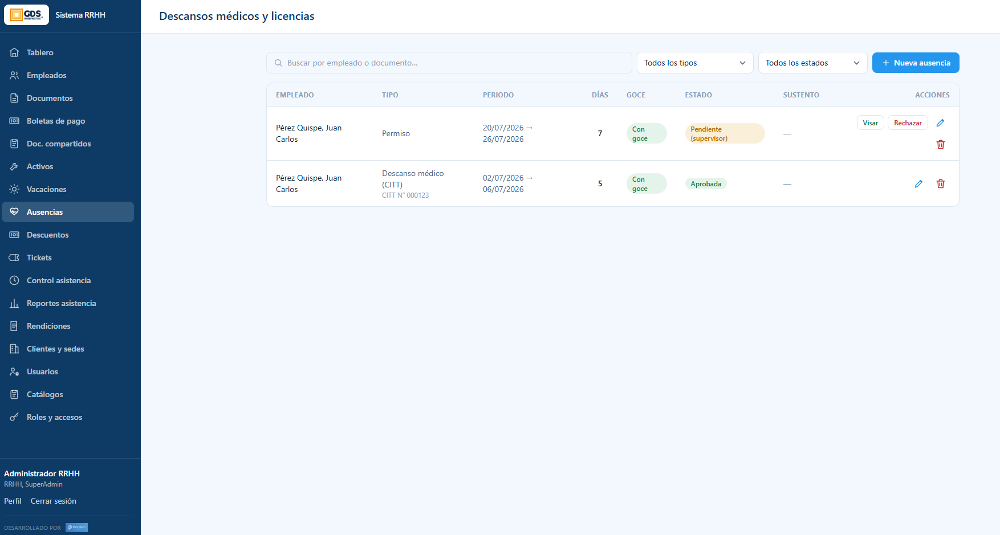
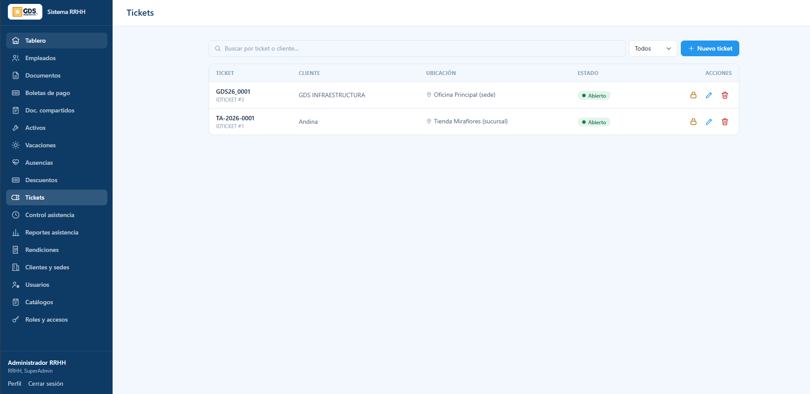
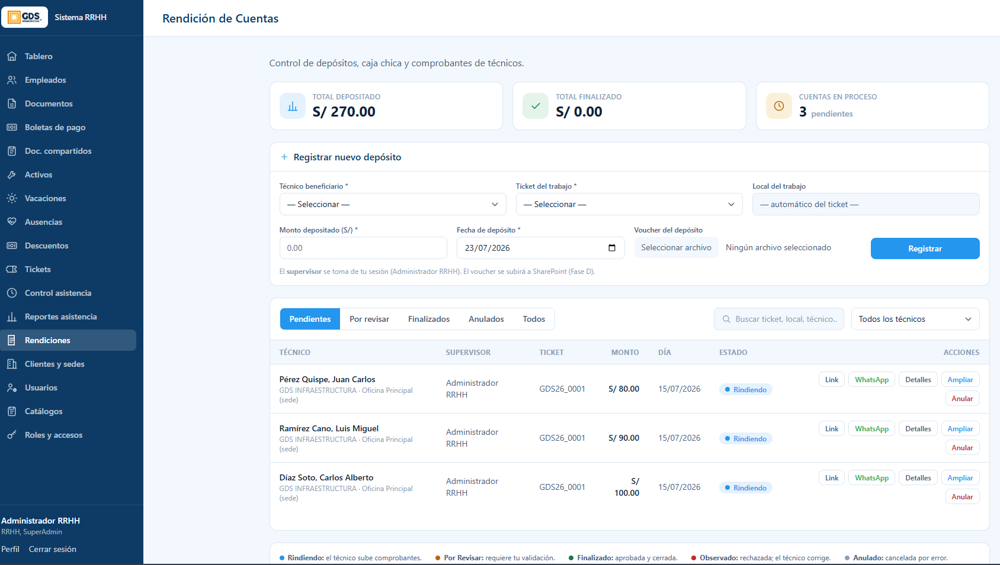

# Guía del Supervisor

> **Tipo:** Guía de usuario (how-to) · **Audiencia:** Supervisores · **Actualizado:** 2026-07-23
>
> Como supervisor gestionas a **tu equipo**: das el visto bueno de su asistencia,
> visas sus solicitudes de licencia, supervisas sus tickets y controlas las
> rendiciones de caja chica que entregas.

## Índice
1. [Tu rol como supervisor](#1-tu-rol-como-supervisor)
2. [Visto Bueno de asistencia](#2-visto-bueno-de-asistencia)
3. [Visar licencias del equipo](#3-visar-licencias-del-equipo)
4. [Tickets](#4-tickets)
5. [Rendiciones de caja chica](#5-rendiciones-de-caja-chica)

---

## 1. Tu rol como supervisor

Ingresa a **https://rrhh.gds.pe** con tu usuario. Tus responsabilidades principales:

- **Validar la asistencia** de tu equipo (Visto Bueno).
- **Visar** las licencias/permisos que soliciten (primer filtro antes de RRHH).
- **Supervisar** los tickets (órdenes de trabajo).
- **Registrar y revisar** las rendiciones de caja chica de tus técnicos.

Como también eres trabajador, tienes tu propio **"Mi espacio"** (marcar asistencia,
ver tus documentos y boletas). Ese autoservicio se explica en la
[Guía del Trabajador](guia-trabajador.md).

---

## 2. Visto Bueno de asistencia

Entra a **Control asistencia** → pestaña **Resumen diario**. Aquí revisas las horas
trabajadas de tu equipo y das tu **Visto Bueno (VB)**.



- Filtra por rango de fechas (**Desde / Hasta**) y por **empleado**.
- Cada fila muestra el **día**, la hora de **ingreso** y **salida**, las **horas
  brutas**, los **refrigerios** y las **horas netas**.
- **Refrigerios (D / A / C)** = Desayuno / Almuerzo / Cena. **Cada refrigerio marcado
  descuenta 1 hora** del total. Actívalos según corresponda a la jornada.
- Las **horas netas** son las brutas menos los refrigerios; son las que cuentan para
  los reportes.

### Dar el Visto Bueno

Cuando la jornada está correcta, pulsa **"Dar VB"** en esa fila. A partir de ahí, la
columna VB muestra un check con **quién validó y cuándo** (ej. *VB — Administrador
RRHH · 23/07 10:34*), dejando la constancia.

> El Visto Bueno es una atribución del **supervisor**. Es tu confirmación de que las
> horas del día de tu personal son correctas.

---

## 3. Visar licencias del equipo

Cuando un trabajador de tu equipo **solicita una licencia** desde su portal, llega a
tu bandeja en el módulo **Ausencias** en estado **Pendiente (supervisor)**.



En la fila de una solicitud pendiente verás dos acciones:

- **Visar** — das tu visto bueno. La solicitud **pasa a RRHH** para la aprobación final.
- **Rechazar** — la deniegas (no avanza).

### Qué pasa al visar

El flujo de una licencia es de **doble aprobación**:

```
Trabajador solicita  →  Supervisor VISA  →  RRHH aprueba
   (pendiente             (pasa a           (queda
    supervisor)            RRHH)             aprobada)
```

Cuando **visas**, la solicitud cambia de *Pendiente (supervisor)* a la bandeja de
**RRHH**, y queda registrado que **tú** diste el visto bueno (con fecha). **Visar no
es aprobar**: tú confirmas que conoces y avalas la ausencia de tu gente; **RRHH** da
la autorización definitiva tras revisar el sustento.

> Revisa el **periodo**, los **días** y el **sustento** adjunto antes de visar.

---

## 4. Tickets

En el módulo **Tickets** ves las órdenes de trabajo, su **cliente**, **ubicación** y
**estado**.



Desde aquí puedes **buscar**, **crear un ticket nuevo** y, en cada fila, **cerrarlo**
(candado), **editarlo** o **eliminarlo**. Los técnicos toman y ejecutan estos tickets
desde su portal, marcando su avance con GPS dentro del local (geocerca).

---

## 5. Rendiciones de caja chica

El módulo **Rendiciones** controla el dinero de caja chica que entregas a tus
técnicos y la rendición de sus gastos.



Las tarjetas de arriba resumen: **total depositado**, **total finalizado** y
**cuentas en proceso**.

### Registrar un depósito

En **"Registrar nuevo depósito"**:
1. Elige el **técnico beneficiario** y el **ticket del trabajo** (el local se toma
   automáticamente del ticket).
2. Ingresa el **monto depositado** y la **fecha**.
3. Adjunta el **voucher del depósito** (opcional; se sube a SharePoint).
4. Pulsa **"Registrar"**. El **supervisor** queda registrado automáticamente (tu sesión).

El técnico recibe un **enlace** para rendir sus gastos (o lo hace desde su portal).

### Seguir y revisar las rendiciones

Las pestañas organizan las cuentas por estado:

| Estado | Significa |
|---|---|
| **Rindiendo** | El técnico está subiendo sus comprobantes. |
| **Por revisar** | Requiere **tu validación** (ya rindió). |
| **Finalizado** | Aprobada y cerrada. |
| **Observado** | Rechazada; el técnico debe corregir. |
| **Anulado** | Cancelada por error. |

En cada fila tienes acciones: **Link** (enlace para el técnico), **WhatsApp** (enviárselo),
**Detalles** (revisar comprobantes), **Ampliar** (agregar monto) y **Anular**.

Cuando una cuenta está **Por revisar**, entra a **Detalles**, valida los comprobantes
(y el voucher de devolución si sobró dinero) y **apruébala** o **obsérvala**.

---

## ¿Dudas?

Para altas de personal, documentos o la aprobación final de licencias, coordina con
**RRHH**. Para problemas técnicos del sistema, contacta a **Sistemas / soporte**.
