# Guía del Trabajador — "Mi espacio"

> **Tipo:** Guía de usuario (how-to) · **Audiencia:** Trabajadores · **Actualizado:** 2026-07-21
>
> Tu portal personal en el Sistema RRHH: marca tu asistencia, revisa tus
> documentos y boletas, solicita licencias y consulta tus vacaciones — todo desde
> un solo lugar llamado **"Mi espacio"**.

## Índice
1. [Cómo ingresar](#1-cómo-ingresar)
2. [Tu espacio de un vistazo](#2-tu-espacio-de-un-vistazo)
3. [Marcar asistencia](#3-marcar-asistencia)
4. [Tickets (órdenes de trabajo)](#4-tickets-órdenes-de-trabajo)
5. [Mis datos](#5-mis-datos)
6. [Mis documentos](#6-mis-documentos)
7. [Mis boletas](#7-mis-boletas)
8. [Mis vacaciones](#8-mis-vacaciones)
9. [Mis ausencias / solicitar licencia](#9-mis-ausencias--solicitar-licencia)
10. [Mis rendiciones](#10-mis-rendiciones)

---

## 1. Cómo ingresar

Abre el sistema en tu navegador: **https://rrhh.gds.pe**

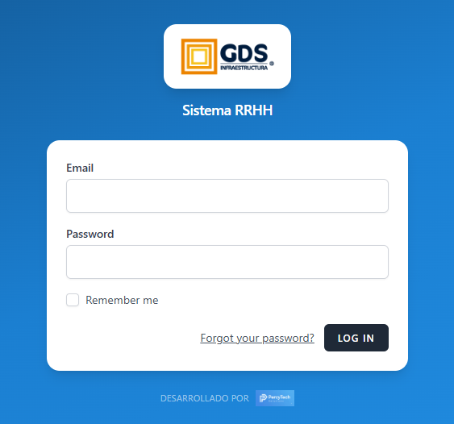

1. Escribe tu **Email** (correo) y tu **Password** (contraseña). Te los entrega el
   área de **RRHH**.
2. *(Opcional)* Marca **"Remember me"** para que el sistema te recuerde en tu
   computadora personal. **No lo marques** en equipos compartidos.
3. Haz clic en **LOG IN**.

Al ingresar, como trabajador, el sistema te lleva directo a tu **"Mi espacio"**.

> **¿Olvidaste tu contraseña?** Haz clic en **"Forgot your password?"** para
> recuperarla, o pídele a RRHH que te la reinicie.
>
> **La primera vez:** se recomienda cambiar la contraseña que te dieron por una
> tuya, desde tu **Perfil**.

---

## 2. Tu espacio de un vistazo

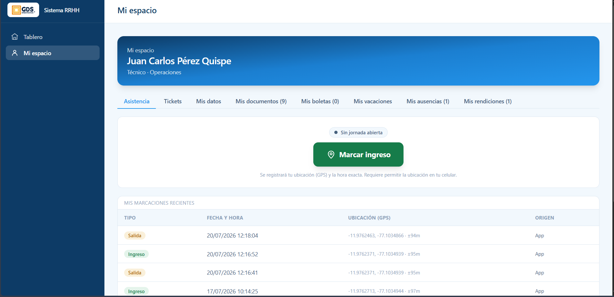

Arriba ves tu **nombre, cargo y área**. Debajo, la fila de **pestañas** te lleva a
cada sección:

| Pestaña | Para qué sirve |
|---|---|
| **Asistencia** | Marcar tu ingreso/salida y ver tus marcaciones |
| **Tickets** | Las órdenes de trabajo asignadas a ti |
| **Mis datos** | Tus datos personales y laborales |
| **Mis documentos** | Tus documentos (contrato, SCTR, EMO, etc.) |
| **Mis boletas** | Tus boletas de pago (y confirmar que las recibiste) |
| **Mis vacaciones** | Tu saldo y solicitudes de vacaciones |
| **Mis ausencias** | Tus licencias/permisos y solicitar uno nuevo |
| **Mis rendiciones** | Rendiciones de caja chica a tu cargo (si aplica) |

> El número entre paréntesis (ej. *Mis documentos (9)*) indica cuántos elementos
> tienes en esa sección.

---

## 3. Marcar asistencia

La pestaña **Asistencia** es la primera que ves al entrar.

**Para marcar tu ingreso:**
1. Verifica el estado: **"Sin jornada abierta"** significa que aún no has marcado ingreso.
2. Pulsa el botón verde **"Marcar ingreso"**.
3. El navegador/celular te pedirá **permitir la ubicación** → acepta. El sistema
   registra tu **ubicación (GPS)** y la **hora exacta**.

**Para marcar tu salida:**
- Una vez con la jornada abierta, el botón cambia a **"Marcar salida"**. Púlsalo al
  terminar tu jornada.

**Tus marcaciones:** aparecen abajo en **"Mis marcaciones recientes"**, con el
**tipo** (Ingreso/Salida), **fecha y hora**, **ubicación GPS** y el **origen**.

> 📍 **Importante:** debes **permitir la ubicación** para poder marcar. Si la
> bloqueaste, actívala en los permisos del navegador/celular e intenta de nuevo.
> La marcación queda con tu ubicación real, así que márcala **en tu lugar de trabajo**.

---

## 4. Tickets (órdenes de trabajo)

En la pestaña **Tickets** ves las órdenes de trabajo asignadas y las tomas y
avanzas paso a paso. El ticket pasa por 3 estados:
**1. Iniciado → 2. En ejecución → 3. Terminado**.

> ⚠️ **Primero marca tu ingreso.** Si no has marcado ingreso (pestaña Asistencia),
> verás el aviso *"Marca tu ingreso para poder tomar tickets"* y no podrás tomarlos.

### Paso 1 — Tomar un ticket

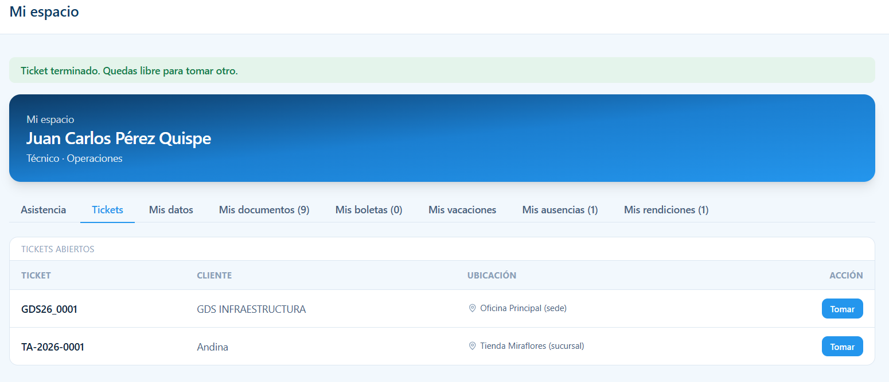

En **"Tickets abiertos"** ves cada ticket con su **cliente** y **ubicación**. Pulsa
**"Tomar"** en el que vas a atender.

### Paso 2 — Ir al local y marcar "En ejecución"

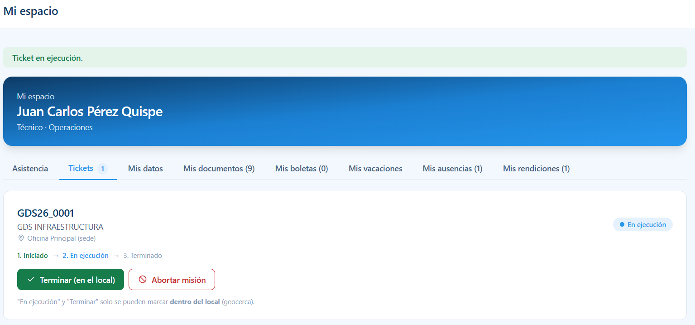

Al tomarlo, el ticket queda en **"Iniciado"**. Cuando llegues **al local del
cliente**, pulsa **"Marcar 'En ejecución' (en el local)"**.

> 📍 **Regla de geocerca:** *"En ejecución"* y *"Terminar"* **solo se pueden marcar
> dentro del local**. El sistema valida tu ubicación GPS. Si no estás en el sitio,
> no te dejará avanzar.
>
> ¿Ya no vas a atenderlo? Pulsa **"Abortar misión"** para liberarlo.

### Paso 3 — Terminar el trabajo

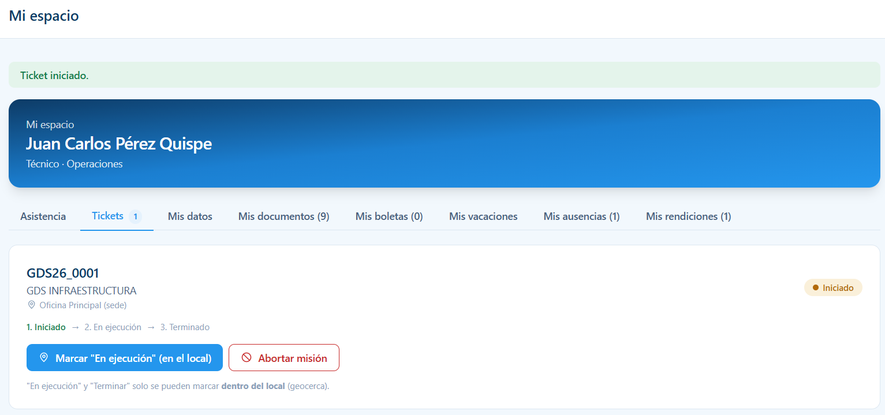

Con el ticket **"En ejecución"**, al concluir el trabajo (y estando en el local)
pulsa **"Terminar (en el local)"**.

Verás el mensaje **"Ticket terminado. Quedas libre para tomar otro"** y podrás
tomar el siguiente.

---

## 5. Mis datos

La pestaña **Mis datos** muestra tu información personal y laboral registrada.

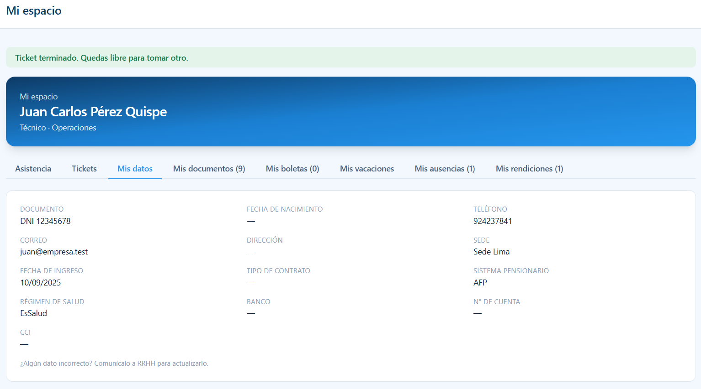

Incluye tu **documento, teléfono, correo, sede, fecha de ingreso, sistema
pensionario, régimen de salud, banco y cuenta**, entre otros. Es **solo de
consulta** (no se edita desde aquí).

> ✏️ **¿Algún dato incorrecto o desactualizado?** No se corrige desde el portal:
> **comunícalo a RRHH** para que lo actualicen. Un guion (**—**) significa que ese
> dato aún no está registrado.

---

## 6. Mis documentos

La pestaña **Mis documentos** lista tus documentos (SCTR, Examen Médico
Ocupacional, contrato, etc.) con su **vencimiento** y **estado**.

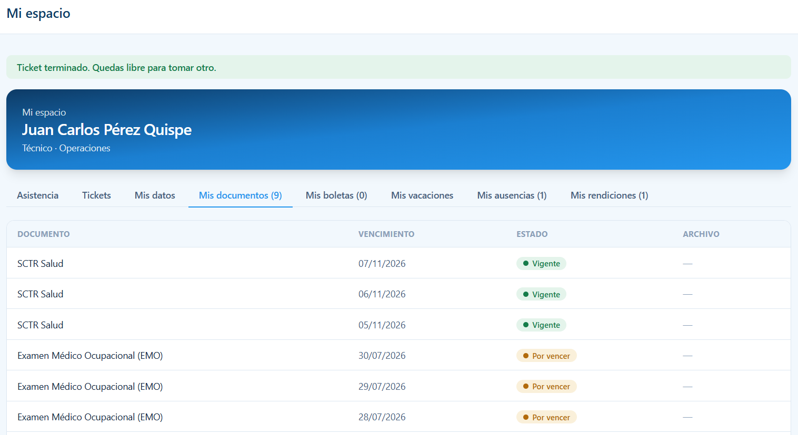

El **estado** funciona como un semáforo:

| Estado | Significa |
|---|---|
| 🟢 **Vigente** | Al día, sin problema. |
| 🟠 **Por vencer** | Se acerca su fecha de vencimiento — atención. |
| 🔴 **Vencido** | Ya venció; hay que renovarlo. |

En la columna **ARCHIVO**, si hay un documento adjunto podrás **verlo o
descargarlo**; un guion (**—**) significa que aún no se cargó el archivo.

> 📄 Esta sección es **informativa**. La carga y renovación de documentos la hace
> **RRHH**. Si ves algo **Por vencer** o **Vencido**, coordínalo con RRHH.

---

## 7. Mis boletas

La pestaña **Mis boletas** muestra tus boletas de pago publicadas por RRHH, por
**periodo** y **tipo**, con opción a **descargarlas** y **confirmar que las recibiste**.

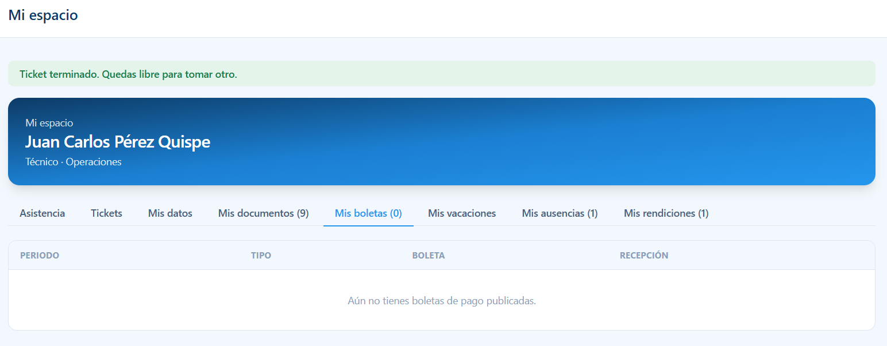

| Columna | Qué es |
|---|---|
| **Periodo** | El mes/periodo de la boleta (ej. julio 2026). |
| **Tipo** | Boleta mensual, gratificación, CTS, etc. |
| **Boleta** | Botón para **ver/descargar** el PDF. |
| **Recepción** | Botón para **confirmar que la recibiste**. |

**Confirmar recepción:** cuando RRHH publica una boleta nueva, la pestaña muestra
un aviso. Descárgala y luego pulsa en **Recepción** para dejar constancia de que la
recibiste (queda registrada la fecha).

> Cuando aún no hay boletas publicadas, verás **"Aún no tienes boletas de pago
> publicadas"**. Las boletas las sube **RRHH**; aquí solo las consultas y confirmas.

---

## 8. Mis vacaciones

La pestaña **Mis vacaciones** muestra tu **saldo disponible** de días y el historial
de tus solicitudes.

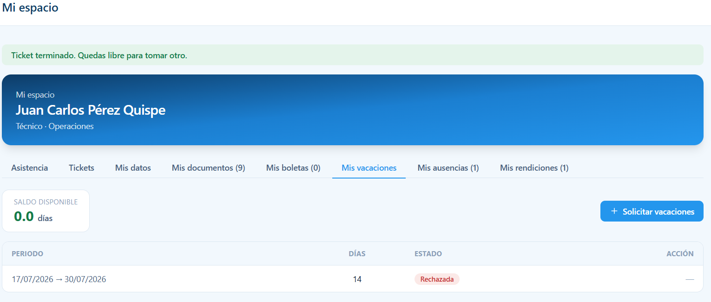

**Solicitar vacaciones:**
1. Pulsa **"+ Solicitar vacaciones"**.
2. Elige el **periodo** (fecha de inicio y fin).
3. Envía la solicitud. Queda en estado **Pendiente** hasta que la revisen.

Cada solicitud muestra su **periodo**, **días** y **estado**:

| Estado | Significa |
|---|---|
| 🟡 **Pendiente** | Enviada, esperando aprobación. |
| 🟢 **Aprobada** | Autorizada. |
| 🔴 **Rechazada** | No autorizada (consulta el motivo con tu jefatura/RRHH). |

> El **saldo disponible** se calcula automáticamente. Solo puedes solicitar hasta
> los días que tengas de saldo. La aprobación la hace tu **supervisor / RRHH**.

---

## 9. Mis ausencias / solicitar licencia

La pestaña **Mis ausencias** reúne tus **licencias y permisos** (descanso médico,
citas, permisos particulares, etc.) y te permite **solicitar uno nuevo**.

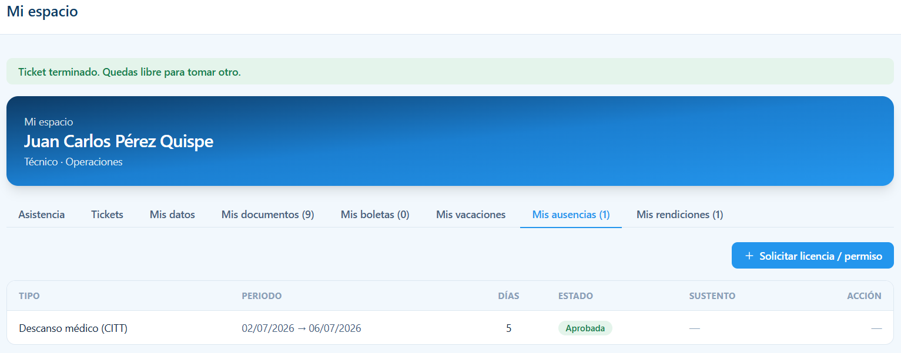

Cada registro muestra el **tipo**, **periodo**, **días**, **estado**, si tiene
**sustento** adjunto y la **acción**.

### Solicitar una licencia o permiso

Pulsa **"+ Solicitar licencia / permiso"** y completa el formulario:

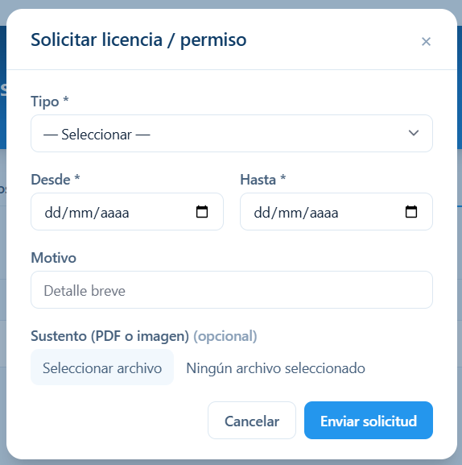

1. **Tipo** — elige el tipo (descanso médico/CITT, cita médica, licencia por
   fallecimiento, maternidad, paternidad, otros…).
2. **Desde / Hasta** — el rango de fechas.
3. **Motivo** — un detalle breve.
4. **Sustento (PDF o imagen)** — adjunta el documento de respaldo. **Según el tipo
   elegido puede ser obligatorio** (ej. el CITT en un descanso médico).
5. Pulsa **"Enviar solicitud"**.

### Qué pasa después: doble aprobación

Tu solicitud recorre **dos pasos** antes de quedar aprobada:

**Tú solicitas → 1) tu Supervisor la visa → 2) RRHH la aprueba.**

| Estado | Significa |
|---|---|
| 🟡 **Pendiente** | Enviada, esperando el visto del supervisor. |
| 🔵 **Visada** | Tu supervisor la aprobó; falta el OK de RRHH. |
| 🟢 **Aprobada** | Autorizada definitivamente. |
| 🔴 **Rechazada** | No autorizada (por supervisor o RRHH). |

> 📎 Adjunta siempre el **sustento** cuando el tipo lo pide, o la solicitud no
> podrá avanzar. Ese archivo se guarda de forma segura junto a tu expediente.

---

## 10. Mis rendiciones

Si recibiste dinero de **caja chica** (para gastos de un trabajo), la pestaña
**Mis rendiciones** te permite **rendir** en qué lo gastaste.

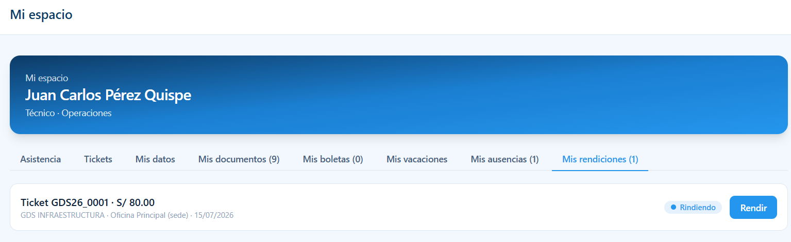

Cada rendición muestra el **ticket**, el **monto entregado**, el **local** y su
**estado** (ej. *Rindiendo*). Pulsa **"Rendir"** para abrir el detalle.

### Cómo rendir

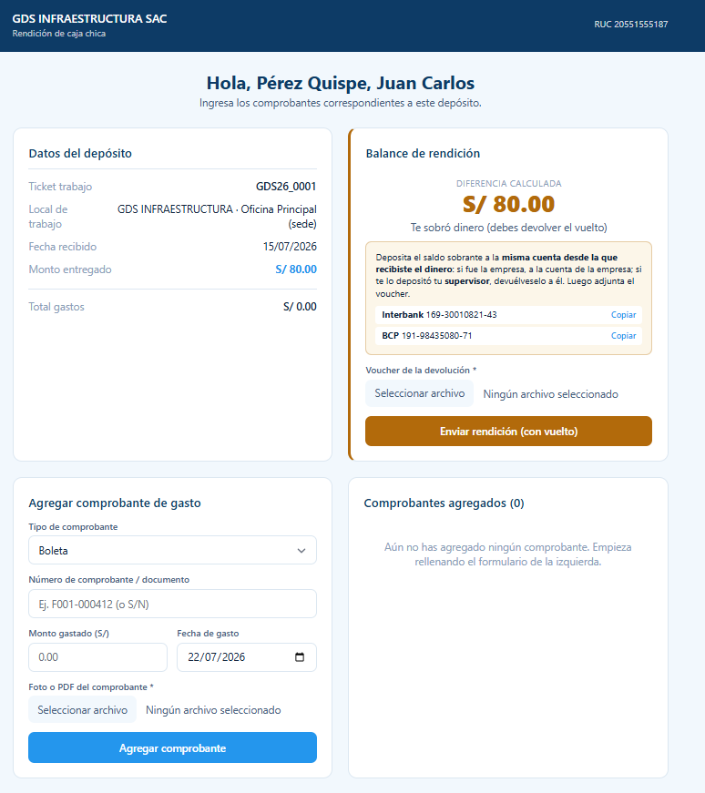

La pantalla tiene todo lo necesario:

**1) Datos del depósito** — ticket, local, fecha y **monto entregado**.

**2) Agregar comprobante de gasto** (columna izquierda) — por cada gasto:
1. **Tipo de comprobante** (Boleta, Factura, etc.).
2. **Número de comprobante** (o "S/N" si no tiene).
3. **Monto gastado** y **fecha del gasto**.
4. **Foto o PDF del comprobante** (obligatorio).
5. Pulsa **"Agregar comprobante"**. Se suma a **"Comprobantes agregados"**.

**3) Balance de rendición** (columna derecha) — el sistema calcula solo la
**diferencia** entre lo entregado y lo gastado:

| Situación | Qué debes hacer |
|---|---|
| **Te sobró dinero** | Deposita el vuelto a la cuenta indicada (Interbank/BCP), adjunta el **voucher de devolución** y pulsa **"Enviar rendición (con vuelto)"**. |
| **Gastaste todo** | Solo envía la rendición con los comprobantes. |
| **Gastaste de más** | La empresa te reintegra la diferencia (según lo indique el balance). |

> 💡 Deposita el sobrante a la **misma cuenta desde la que recibiste el dinero**:
> si fue la empresa, a la cuenta de la empresa; si te lo depositó tu supervisor,
> devuélveselo a él. Luego adjunta el voucher.

Una vez enviada, tu rendición pasa a **revisión y aprobación** (RRHH/Contabilidad).

---

## ¿Necesitas ayuda?

Si algo no funciona o tienes dudas sobre tus datos, documentos o pagos, comunícate
con el área de **RRHH**. Para problemas técnicos (no puedes entrar, error en
pantalla), contacta al soporte del sistema.
